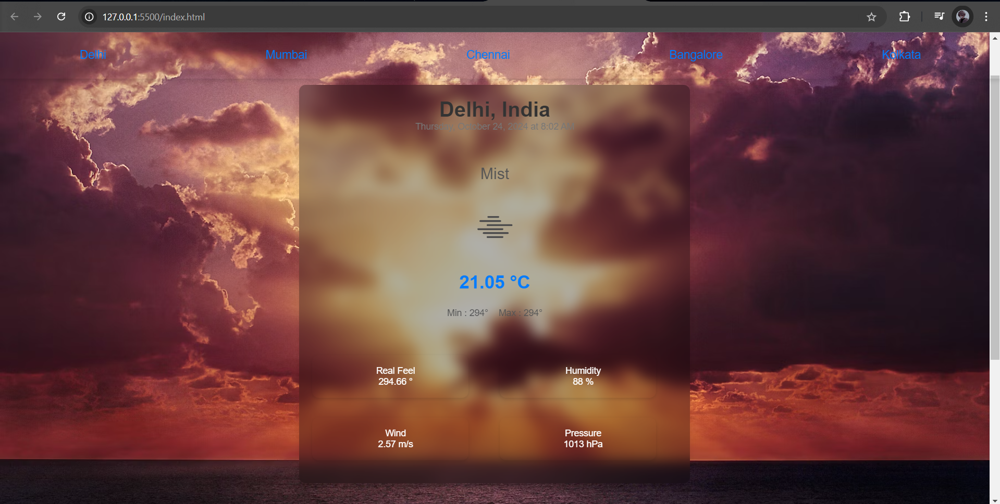

# Real-Time Data Processing System for Weather Monitoring with Rollups and Aggregates

This project is a real-time weather monitoring system that processes weather data from multiple cities, providing current conditions, daily summaries, and statistical aggregates. It includes features such as displaying temperature, humidity, wind speed, pressure, and weather conditions, as well as tracking the daily temperature trends and issuing alerts for specific conditions (e.g., high temperature).

## Features

- **Real-time weather updates**: Fetches and displays real-time weather information using the OpenWeatherMap API.
- **City-based monitoring**: Track weather conditions for various cities by selecting them dynamically.
- **Daily weather summary**: Calculates average, maximum, and minimum temperatures as well as the dominant weather condition for the day.
- **Weather alerts**: Issue alerts based on defined thresholds (e.g., high temperatures).
- **User-friendly interface**: Responsive and easy-to-navigate UI displaying weather details, including temperature, humidity, wind speed, and more.

## Technologies Used

- **JavaScript**: For frontend logic and weather data processing.
- **OpenWeatherMap API**: For fetching real-time weather data.
- **HTML & CSS**: Basic structure and styling of the web app.
- **Git**: Version control.
- **GitHub**: Hosting the project repository.

## Installation

1. Clone the repository:

    ```bash
    git clone https://github.com/gauravbhakuni/Real-Time-Data-Processing-System-for-Weather-Monitoring-with-Rollups-and-Aggregates.git
    ```

2. Navigate to the project directory:

    ```bash
    cd Real-Time-Data-Processing-System-for-Weather-Monitoring-with-Rollups-and-Aggregates
    ```

3. Install dependencies (if any):

    ```bash
    npm install
    ```

4. Create an `.env` file in the root directory and add your OpenWeatherMap API key:

    ```bash
    API_KEY=your_openweathermap_api_key
    ```

5. Run the project:

    ```bash
    npm start
    ```

## Usage

1. Open the app in a web browser.
2. The weather information for the default city (e.g., Delhi) will be displayed.
3. To view the weather for a different city, input the city name, and the real-time weather data will be fetched and displayed.
4. The daily summary provides temperature statistics and the dominant weather condition of the day.

## API Integration

The project uses the [OpenWeatherMap API](https://openweathermap.org/api) to fetch real-time weather data. Please ensure you have an API key to access the weather data.

- Example API endpoint:

    ```
    https://api.openweathermap.org/data/2.5/weather?q=CityName&appid=your_api_key
    ```

## Screenshots


*Real-time weather dashboard with data for selected cities.*


*Daily summary of weather data, showing average, max, and min temperatures.*

## Contributing

1. Fork the repository.
2. Create a new branch:

    ```bash
    git checkout -b feature-branch
    ```

3. Make your changes and commit them:

    ```bash
    git commit -m "Add some feature"
    ```

4. Push to the branch:

    ```bash
    git push origin feature-branch
    ```

5. Submit a pull request.

## License

This project is licensed under the MIT License. See the [LICENSE](LICENSE) file for details.

## Contact

For any questions or feedback, feel free to reach out to:

- **Gaurav Bhakuni**
- https://www.linkedin.com/in/gaurav-singh-bhakuni-gsb123/
